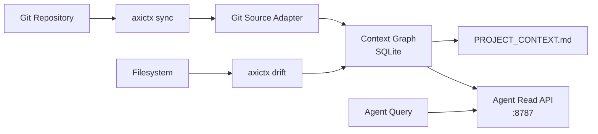

# AxiContext 🧠

<p align="center">
  <a href="https://github.com/LatticeAG/AxiContext/blob/main/LICENSE">
    
  </a>
  <a href="https://github.com/LatticeAG/AxiContext">
    
  </a>
  <a href="https://github.com/LatticeAG/AxiContext/stargazers">
    
  </a>
  <a href="https://github.com/LatticeAG/AxiContext/issues">
    
  </a>
  <a href="https://github.com/LatticeAG/AxiContext">
    
  </a>
</p>

<p align="center">
  <b>Project context controller for AI coding agents.</b><br/>
  Local-first. Source-aware. Agent-native.
</p>

<p align="center">
  <a href="#quick-start">Quick Start</a> ·
  <a href="#why-axicontext">Why AxiContext</a> ·
  <a href="#how-it-works">How It Works</a> ·
  <a href="#features">Features</a> ·
  <a href="#monorepo-layout">Layout</a> ·
  <a href="#agent-integration">Agent Integration</a>
</p>

---

AxiContext generates and maintains `PROJECT_CONTEXT.md`, a SQLite Context Graph under `.axicontext/`, and a local Agent Read API so agents query structured project memory with provenance -- instead of re-reading the entire repo every time.

Built for AI coding agents that need to stay coherent across sessions without burning context on repeated file scans. OSS-first, MIT-licensed, zero external dependencies.

> **Scope:** OSS Phase 1 only. See [SPEC.md](./SPEC.md) for the full implementation specification.

## Why AxiContext

- **Eliminates redundant repo scanning** - agents re-read the same files every session. AxiContext caches structured project knowledge with provenance so agents start each session informed.
- **Live drift detection** - the Context Graph knows the declared state vs actual filesystem state. `axictx drift` surfaces inconsistencies before they cause bugs.
- **Agent-native query API** - local HTTP server at `127.0.0.1:8787` lets agents ask "what does the auth module do?" without parsing an entire `PROJECT_CONTEXT.md` string.
- **Full-text search over context excerpts** - `axictx query "auth middleware"` returns ranked excerpts from the Graph, not grep hits on source files.
- **Framework-agnostic** - integrates with Cursor, Claude Code, Copilot, or any agent that can read a file or hit an HTTP endpoint.
- **Git-aware synchronization** - `axictx sync` ingests sources, updates the Graph, and regenerates `PROJECT_CONTEXT.md` in a single command. Git adapter means it understands your project's structure naturally.

### How AxiContext is different

- **Graph, not flat file** - a SQLite Context Graph preserves relationships between modules, APIs, tests, and configs. A flat `CONTEXT.md` loses the connections.
- **Provenance-tracked** - every excerpt in the context store knows which file it came from, when it was last synced, and whether it's drifted. No stale context poisoning.
- **Designed for agentic workflows** - the Agent Read API supports `topic` filtering and `max_tokens` budgeting, letting agents efficiently request exactly the context they need.

## Quick Start

```bash
pnpm install
pnpm build

# In any git repository:
pnpm --filter @latticeag/axicontext start -- init
pnpm --filter @latticeag/axicontext start -- sync
pnpm --filter @latticeag/axicontext start -- drift
pnpm --filter @latticeag/axicontext start -- serve
```

### Commands

| Command | Description |
|---------|-------------|
| `axictx init` | Scaffold `.axicontext/` directory |
| `axictx doctor` | Validate setup and dependencies |
| `axictx sync` | Ingest sources, build Graph, write `PROJECT_CONTEXT.md` |
| `axictx drift` | Compare live state vs manifest |
| `axictx query "..."` | FTS search over context excerpts |
| `axictx serve` | Start `http://127.0.0.1:8787` Agent Read API |
| `axictx status` | Manifest + Graph summary |

## How It Works



## Features

### Core

| Feature | Description |
|---------|------------|
| **Context Graph** | SQLite-backed graph preserving module relationships, API contracts, and config structure. |
| **PROJECT_CONTEXT.md** | Auto-generated markdown summary for agents that prefer static file intake. |
| **Drift Detection** | Compares Graph manifest against live filesystem, flags stale or missing entries. |
| **Full-Text Search** | Ranked FTS5 search over all context excerpts. |
| **Git Source Adapter** | Understands project structure from git metadata -- no manual config. |

### Advanced

| Feature | Description |
|---------|------------|
| **Agent Read API** | HTTP server with `topic` filtering and `max_tokens` budgeting for efficient agent queries. |
| **Provenance Tracking** | Every excerpt knows its source file, sync timestamp, and drift status. |
| **Incremental Sync** | Only re-processes changed files since last sync. |
| **Zero Dependencies** | Self-contained SQLite-backed CLI. No Docker, no external services. |

## Agent Integration

Point Cursor or Claude Code at `PROJECT_CONTEXT.md`, or query the local API:

```http
GET http://127.0.0.1:8787/v1/context/slice?topic=authentication&max_tokens=2000
```

The API returns structured context slices with provenance metadata, letting your agent request exactly what it needs without drowning in irrelevant project details.

## Monorepo Layout

```text
axicontext/
├── packages/
│   ├── axicontext/              # CLI (axictx)
│   ├── axicontext-core/         # Graph, sync, drift, config
│   ├── axicontext-server/       # Local Agent Read API (Hono)
│   ├── axicontext-sdk/          # TypeScript SDK
│   └── axicontext-adapter-git/  # Git source adapter
├── testdata/
│   └── fixtures/
│       └── minimal-node-repo/   # Fixture for integration tests
├── SPEC.md                      # Full implementation specification
├── LICENSE                      # MIT
└── README.md                    # This file
```

## Development

```bash
pnpm build
pnpm test
```

Fixture repo: `testdata/fixtures/minimal-node-repo/`

## Known Issues

- **Initial sync on large repos** - The first `axictx sync` on a monorepo with thousands of files can take 30-60s. Subsequent syncs are incremental and much faster.
- **SQLite locking** - Concurrent `sync` and `serve` on the same Graph can cause SQLITE_BUSY. Avoid running both simultaneously against the same project.

## License

MIT -- see [LICENSE](./LICENSE). Copyright &copy; 2026 LatticeAG.
