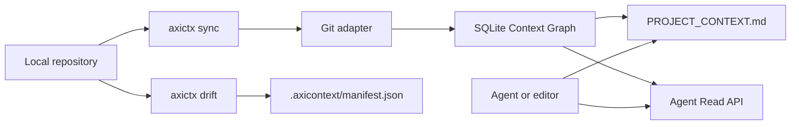

# AxiContext

AxiContext is an open source project context controller for AI coding agents.

It reads a local repository, writes a reviewable `PROJECT_CONTEXT.md`, stores structured context in a SQLite graph under `.axicontext/`, and exposes a local Agent Read API for tools that prefer JSON over Markdown.

The goal is simple: give agents a truthful project memory that can be regenerated, reviewed, queried, and checked for drift. The OSS build does not phone home to LatticeAG.

## Project specs

- [SPEC.md](./SPEC.md) defines AxiContext OSS behavior.
- [SPEC-BUILD.md](./SPEC-BUILD.md) defines the build phases and package layout.
- [SPEC-AxiFence.md](./SPEC-AxiFence.md) defines the AxiFence companion CLI.
- [SPEC-IMPROVE.md](./SPEC-IMPROVE.md) tracks the current quality pass.

## What works in this repository

| Area | Status |
|------|--------|
| `axictx init` | Creates `.axicontext/config.toml` and a starter `PROJECT_CONTEXT.md`. |
| `axictx sync` | Runs local adapters, writes `.axicontext/manifest.json`, creates the SQLite graph, and regenerates `PROJECT_CONTEXT.md`. |
| `axictx drift` | Compares the current repo against the saved manifest, with CI annotations and fail-on-drift support. |
| `axictx query` | Searches graph excerpts with provenance. |
| `axictx serve` | Starts the loopback Agent Read API on `127.0.0.1:8787` by default. |
| `@latticeag/axicontext-sdk` | Provides in-process and HTTP client helpers. |
| `axi-fence check` | Scores whether a repo has enough setup metadata for a generated DevContainer. |
| `axi-fence run` | Generates reviewable DevContainer, compose, bootstrap, and setup docs. |
| `axi-fence badge` | Prints a Shields badge or JSON status for setup readiness. |

AxiContext currently performs a full sync. Incremental sync, cloud sync, hosted dashboards, embeddings, and MCP are not claimed for v0.1. AxiFence is deterministic and rule-based. It does not call an LLM.

## Quickstart for AxiContext

Install the CLI once packages are published:

```bash
npm install -g @latticeag/axicontext
```

Or run it without a global install:

```bash
npx @latticeag/axicontext init
```

Use it inside a repository:

```bash
cd your-repo
axictx init
axictx sync
axictx drift
axictx query "how does authentication work?" --json
axictx serve
```

For CI:

```bash
axictx drift --ci --fail-on-drift
```

## Quickstart for AxiFence

Install the companion CLI once packages are published:

```bash
npm install -g @latticeag/axi-fence
```

Use it inside a repository:

```bash
cd your-repo
axi-fence check .
axi-fence run . --dry-run
axi-fence run . --out . --overwrite
axi-fence badge . --json
```

`axi-fence run` writes `.devcontainer/devcontainer.json`, an optional `.devcontainer/docker-compose.yml`, `scripts/bootstrap.sh`, and `README-SETUP.md`. Use `--dry-run` to review generated content before writing files.

## Quickstart for contributors

This repo uses Node.js 22 and pnpm.

```bash
corepack enable
pnpm install
pnpm build
pnpm test
pnpm typecheck
```

Run the local CLI after build:

```bash
pnpm --filter @latticeag/axicontext start -- init
pnpm --filter @latticeag/axicontext start -- sync
pnpm --filter @latticeag/axicontext start -- drift
```

## Commands

| Command | Description |
|---------|-------------|
| `axictx init` | Scaffold `.axicontext/config.toml` and `PROJECT_CONTEXT.md`. |
| `axictx doctor` | Validate Node and local config. |
| `axictx sync` | Run the local adapters, update the manifest, write the SQLite graph, and regenerate `PROJECT_CONTEXT.md`. |
| `axictx drift` | Report context drift, with CI annotations when `--ci` is passed. |
| `axictx query "..."` | Search generated context excerpts and return matching provenance. |
| `axictx serve` | Start the loopback Agent Read API. |
| `axictx status` | Print manifest and context summary data. |

## How it fits together



`PROJECT_CONTEXT.md` is for agents and editors that read files. The SQLite graph is the source for structured slices, query, and drift. The manifest records the generated state that CI can compare against later.

## Agent integration

Point an agent at `PROJECT_CONTEXT.md`, or query the local API:

```bash
curl "http://127.0.0.1:8787/v1/context/slice?topic=authentication&max_tokens=2000"
```

For keyword query:

```bash
curl -X POST "http://127.0.0.1:8787/v1/context/query" \
  -H "content-type: application/json" \
  -d '{"question":"how does authentication work?","max_tokens":2000}'
```

See [docs/agent-integration.md](./docs/agent-integration.md).

## Monorepo layout

```text
/
|-- packages/
|   |-- cli/            # @latticeag/axicontext, bin axictx
|   |-- core/           # config, sync, graph, drift, query
|   |-- sdk/            # TypeScript SDK
|   |-- server/         # local Agent Read API
|   |-- adapters-git/   # Git and filesystem source adapter
|   |-- parsers/        # shared repo analysis package, per SPEC-BUILD
|   |-- fence-core/     # AxiFence inference core, per SPEC-AxiFence
|   `-- fence/          # @latticeag/axi-fence CLI, per SPEC-AxiFence
|-- docs/
|-- testdata/
|   `-- fixtures/
|       `-- minimal-node-repo/
|-- SPEC.md
|-- SPEC-BUILD.md
`-- SPEC-AxiFence.md
```

Some package directories in the target layout may be introduced by later phase work. `pnpm-workspace.yaml` tracks the intended workspace entries so package creation does not require another metadata pass.

## Documentation

- [Install](./docs/install.md)
- [Config](./docs/config.md)
- [Agent integration](./docs/agent-integration.md)
- [CI](./docs/ci.md)
- [AxiFence](./docs/fence.md)
- [Security](./docs/security.md)
- [Schema](./docs/schema.md)

## License

MIT. See [LICENSE](./LICENSE).
